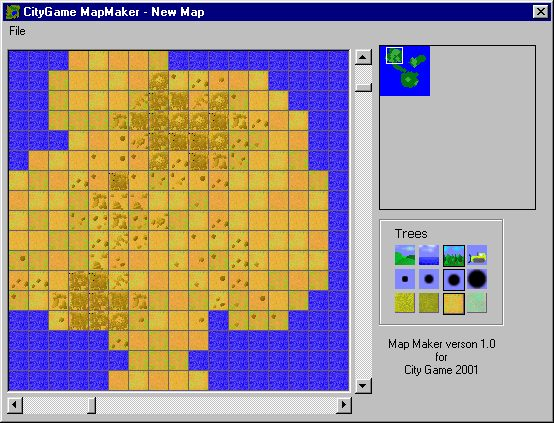

<div align="center">

## See Ville \- Map Maker


</div>

### Description

This program is the official MAP MAKER for "See Ville", another of my current projects. As far as I', aware of there's no bugs, and the mapper is (unlike See Ville itself) ready to ship.
 
### More Info
 


<span>             |<span>
---                |---
**Submitted On**   |2001-07-22 22:33:24
**By**             |[Jonas Ask](https://github.com/Planet-Source-Code/PSCIndex/blob/master/ByAuthor/jonas-ask.md)
**Level**          |Intermediate
**User Rating**    |5.0 (15 globes from 3 users)
**Compatibility**  |VB 6\.0
**Category**       |[Games](https://github.com/Planet-Source-Code/PSCIndex/blob/master/ByCategory/games__1-38.md)
**World**          |[Visual Basic](https://github.com/Planet-Source-Code/PSCIndex/blob/master/ByWorld/visual-basic.md)
**Archive File**   |[See Ville 232587222001\.zip](https://github.com/Planet-Source-Code/jonas-ask-see-ville-map-maker__1-25325/archive/master.zip)

### API Declarations

```
Function BitBlt Lib "gdi32"Function
Function GetTickCount Lib "kernel32.dll"
```


